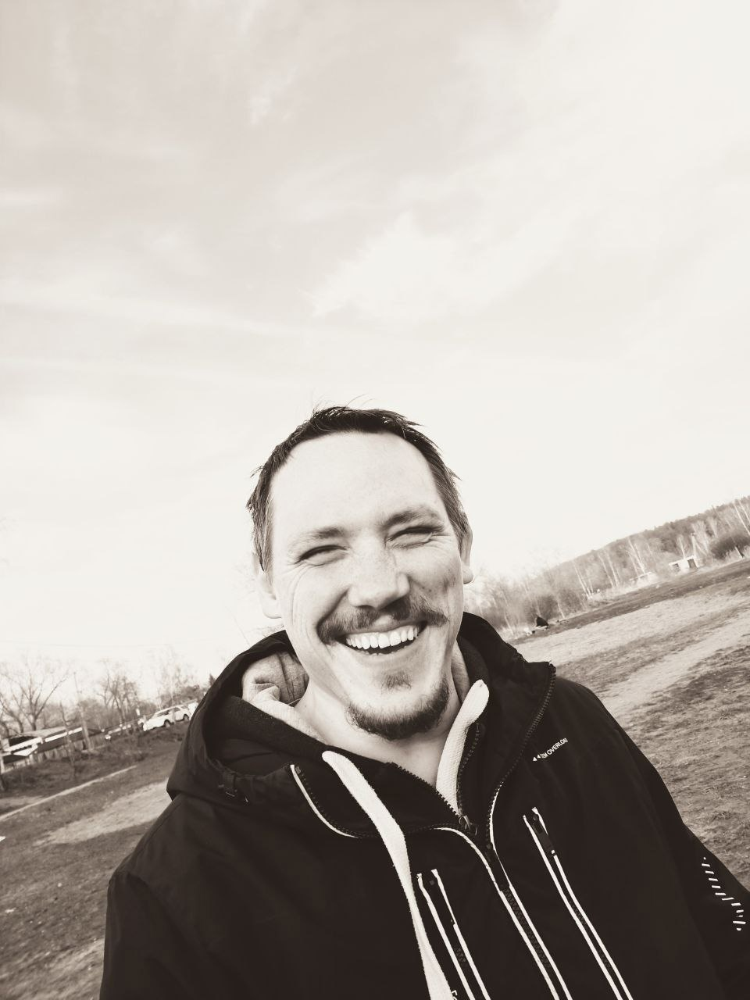

# Кирдяшев Василий Николаевич
Родился 21 июня 1989 года  
Junior Frontend-разработчик

## Обо мне:

Проживаю в подмосковном Королёве, с 2016 года изучаю фронтенд. В 2022 году прошел профессиональную переподготовку в АНО ВО "Университет Иннополис" по дополнительной профессиональной программе "Основы Frontend-разработки" с присвоением мне квалификации "Младший frontend-разработчик". В настоящее время продолжаю изучать фронтенд самостоятельно и на курсах Нетологии "Frontend-разработчик с нуля до middle».  

## Образование:

В 2012 году с отличием окончил Федеральное государственное бюджетное образовательное учреждение высшего профессионального образования "Московский государственный университет путей сообщения" г. Москва по специальности "Стоматология ортопедическая".

## Стек навыков:

- Валидная семантическая, кроссбраузерная, адаптивная верстка, в том числе <u>**Pixel Perfect**</u>.  
- HTML5, CSS3, JavaScript(ES6),  
- методология БЭМ, SCSS, Git, Github, Figma, VSCode,  
- bootstrap(основы), React(основы), Redux(основы).  

## Языки:

Русский родной, Английский B1 (Intermediate)

## Портфолио:

https://elastomaniac.github.io/mq-diploma2/  
https://elastomaniac.github.io/my-portfolio-plants/  
https://elastomaniac.github.io/my-portfolio-house-windows/  
https://elastomaniac.github.io/tic-tac-toe/  
https://elastomaniac.github.io/my-portfolio-registration-form/

## Контакты: 
(Я расположил их в порядке приоритетности по убыванию)

1. Telegram: @Elastomaniac  
2. VK: https://vk.com/elastomaniac  
3. email: vasyan89@gmail.com  
4. Tel: +79164482945  
5. Discord: Кирдяшев Василий FE-63#3013
6. GitHub: https://github.com/Elastomaniac  
